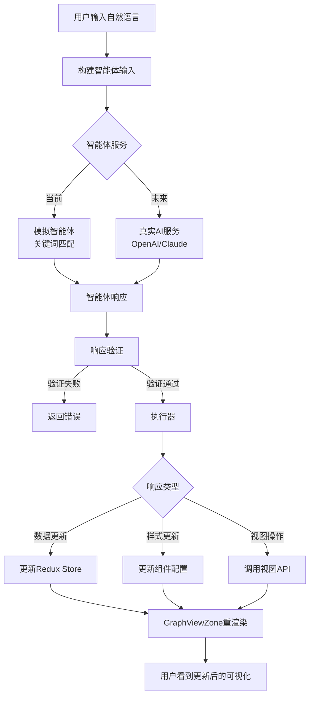
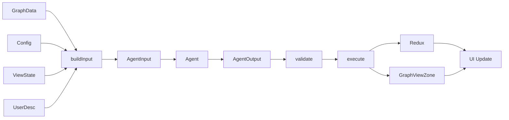
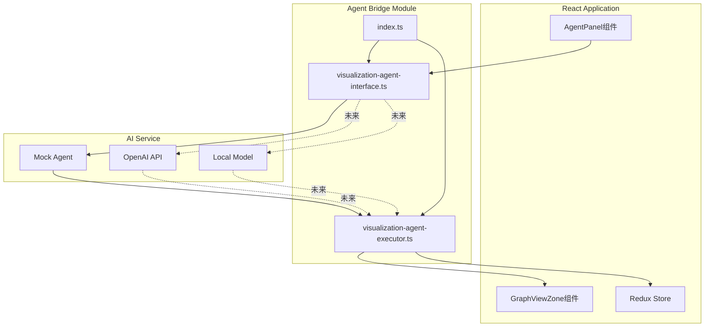
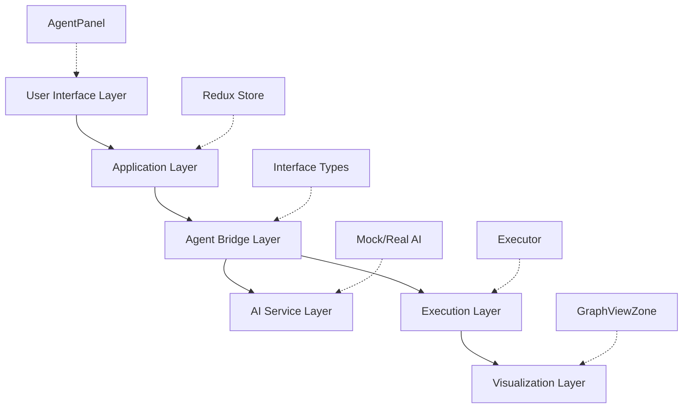
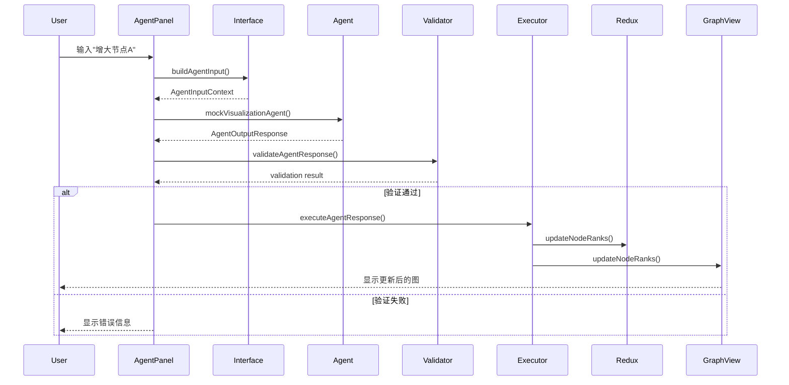

# 🏗️ 可视化智能体架构设计

## 系统架构图



## 数据流图



## 模块关系图



## 接口层次图



## 时序图：完整交互流程



## 核心组件职责

### 1. Interface Layer (接口层)

**文件**: `visualization-agent-interface.ts`

**职责**:
- 定义输入输出类型
- 提供输入构建函数
- 实现响应验证
- 提供模拟智能体

**关键函数**:
- `buildAgentInputFromState()`: 构建输入
- `mockVisualizationAgent()`: 模拟智能体
- `validateAgentResponse()`: 验证响应

### 2. Executor Layer (执行层)

**文件**: `visualization-agent-executor.ts`

**职责**:
- 解析智能体响应
- 执行数据更新
- 执行样式更新
- 执行视图操作

**关键函数**:
- `executeAgentResponse()`: 主执行函数
- `executeDataUpdate()`: 数据更新
- `executeStyleUpdate()`: 样式更新
- `executeViewAction()`: 视图操作

### 3. UI Layer (界面层)

**文件**: `AgentPanel/index.tsx`

**职责**:
- 提供用户交互界面
- 收集用户输入
- 显示执行历史
- 展示执行结果

**关键功能**:
- 自然语言输入框
- 示例快捷按钮
- 历史记录显示
- 状态反馈

## 扩展点

### 1. AI服务扩展

```typescript
// 替换模拟智能体为真实AI
export async function callVisualizationAgent(
  input: AgentInputContext
): Promise<AgentOutputResponse> {
  // 方案1: OpenAI
  const response = await openai.chat.completions.create({...});
  
  // 方案2: 本地模型
  const response = await fetch('http://localhost:8000/api/agent', {...});
  
  return parseResponse(response);
}
```

### 2. 响应类型扩展

```typescript
// 添加新的响应类型
interface AgentOutputResponse {
  // 现有字段...
  
  // 新增：批量操作
  batch?: {
    operations: Array<AgentOutputResponse>;
    sequential: boolean;
  };
  
  // 新增：条件执行
  conditional?: {
    condition: string;
    ifTrue: AgentOutputResponse;
    ifFalse: AgentOutputResponse;
  };
}
```

### 3. 执行器功能扩展

```typescript
// 添加新的执行类型
async function executeCustomAction(
  action: CustomAction,
  config: ExecutorConfig
): Promise<void> {
  // 实现自定义操作
}
```

## 技术选型说明

### TypeScript
- ✅ 类型安全
- ✅ 接口清晰
- ✅ IDE支持好

### React
- ✅ 组件化
- ✅ 生态丰富
- ✅ 易于集成

### Redux
- ✅ 状态管理
- ✅ 时间旅行
- ✅ 可预测性

### D3.js
- ✅ 强大的可视化能力
- ✅ 灵活的数据绑定
- ✅ 丰富的动画支持

## 性能优化

### 1. 响应缓存
```typescript
const responseCache = new Map<string, AgentOutputResponse>();

function getCachedResponse(key: string) {
  if (responseCache.has(key)) {
    console.log('使用缓存响应');
    return responseCache.get(key);
  }
  // 调用智能体...
}
```

### 2. 批量更新
```typescript
// 合并多个小更新为一次大更新
const batched = batchUpdates([update1, update2, update3]);
await executeAgentResponse(batched, config);
```

### 3. 异步执行
```typescript
// 并行执行独立的更新
await Promise.all([
  executeDataUpdate(...),
  executeStyleUpdate(...)
]);
```

## 安全考虑

### 1. 输入验证
```typescript
function validateUserInput(description: string): boolean {
  // 检查长度
  if (description.length > 1000) return false;
  
  // 检查恶意内容
  if (containsMaliciousCode(description)) return false;
  
  return true;
}
```

### 2. 响应验证
```typescript
function validateAgentResponse(response: AgentOutputResponse) {
  // 检查数值范围
  // 检查必填字段
  // 检查数据类型
}
```

### 3. 权限控制
```typescript
function checkPermission(action: string): boolean {
  // 检查用户是否有权限执行该操作
  return hasPermission(currentUser, action);
}
```

---

**注意**: 此架构设计为可扩展、模块化，可根据实际需求调整。
